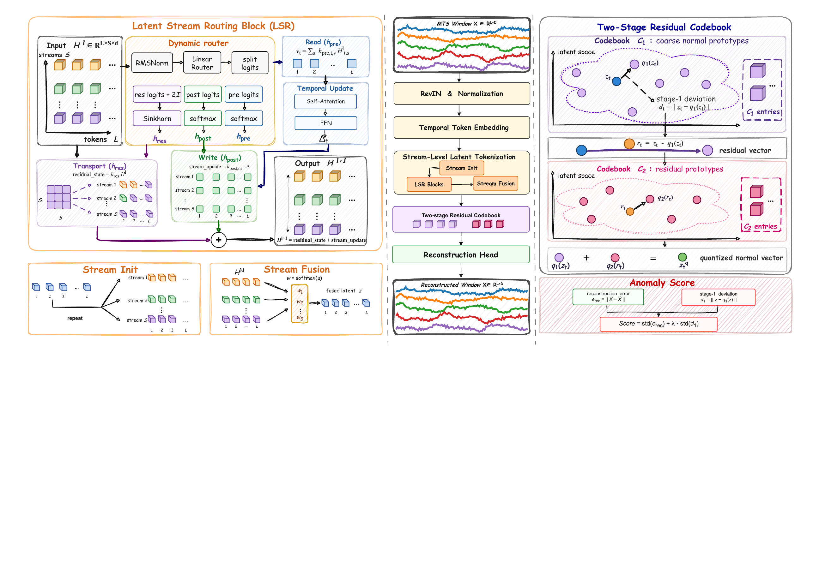

# ALV_AD: Latent-Stream Routing for Multivariate Time Series Anomaly Detection

**ALV_AD** is a PyTorch implementation of a reconstruction-based anomaly detection framework for multivariate time series. The model combines latent stream routing, residual vector quantization, and hybrid anomaly scoring to detect abnormal temporal patterns from unlabeled training data.

**Environment:** Python 3.8+ | PyTorch 2.x

This repository contains the main model code, benchmark integration, and curated real-world benchmark scripts for ALV_AD. Large datasets, experiment logs, and private search scripts are not included in this code release.

## Overview

ALV_AD learns normal temporal dynamics by reconstructing multivariate windows. Instead of using a single latent trajectory, the model maintains multiple latent streams and dynamically routes information between them. A residual vector quantizer then maps latent states to learned normal prototypes, producing both reconstruction errors and latent deviation scores for anomaly detection.

<div align="center">
  
</div>

The original framework figure is also available as [docs/overview.pdf](docs/overview.pdf).

## Key Features

- **Latent Stream Routing Block (LSR)**: maintains multiple latent streams and uses a dynamic router to select pre-attention streams, post-attention updates, and residual stream transport.
- **Sinkhorn-based residual routing**: encourages structured stream-to-stream transport with approximately normalized routing matrices.
- **Residual vector quantization**: learns codebook prototypes of normal latent behavior and measures latent deviation from these prototypes.
- **Hybrid anomaly scoring**: supports reconstruction-only scoring and reconstruction-plus-quantizer scoring through modes such as `recon`, `recon_rvq`, and `recon_stage1`.
- **Benchmark-compatible interface**: provides `detect_fit`, `detect_score`, and `detect_label` APIs for integration with the included time-series benchmark framework.

## Repository Structure

```text
ALV_AD/
+-- config/                               # Benchmark configuration templates
+-- docs/
|   +-- overview.pdf                      # Original framework figure
|   +-- overview.png                      # GitHub-friendly framework figure
+-- requirements.txt                      # Exported development environment
+-- scripts/
|   +-- multivariate_detection/           # Real-world benchmark run scripts
+-- ts_benchmark/
    +-- baselines/
    |   +-- alv_ad_transformer/           # Main ALV_AD implementation
    +-- data/                             # Dataset loading utilities
    +-- evaluation/                       # Evaluation logic
    +-- models/                           # Model loading utilities
```

## Installation

Create a Python environment and install the dependencies:

```bash
pip install -r requirements.txt
```

The exported dependency file was generated from the development conda environment. If you prefer a lighter environment, the core model depends mainly on PyTorch, NumPy, pandas, scikit-learn, and common scientific Python packages.

## Data Preparation

Datasets are not included in this repository. Prepare your own multivariate time-series datasets and place them under a local `dataset/` directory or adapt the loaders in `ts_benchmark/data/`.

The detector expects training and test inputs as pandas `DataFrame` objects with timestamps or ordered indices and one column per variable.

## Quick Start

Use the model directly from Python:

```python
import pandas as pd

from ts_benchmark.baselines.alv_ad_transformer import ALV_AD_Transformer

train_df = pd.read_csv("dataset/train.csv", index_col=0)
test_df = pd.read_csv("dataset/test.csv", index_col=0)

model = ALV_AD_Transformer(
    seq_len=100,
    batch_size=128,
    num_epochs=10,
    d_model=128,
    d_ff=256,
    e_layers=2,
    n_heads=8,
    n_streams=6,
    score_modes="recon_stage1",
    hybrid_score_lambda=1.0,
)

model.detect_fit(train_df, test_df)
score_components, anomaly_score = model.detect_score(test_df)
predictions, primary_score = model.detect_label(test_df)
```

For benchmark-based loading, the main model entry is:

```text
alv_ad_transformer.ALV_AD_Transformer
```

## Main Hyperparameters

| Argument | Description |
|---|---|
| `seq_len` | Sliding window length. |
| `d_model` | Latent embedding dimension. |
| `d_ff` | Feed-forward hidden dimension in each routing block. |
| `e_layers` | Number of ALV_AD routing layers. |
| `n_heads` | Number of attention heads. |
| `n_streams` | Number of latent streams maintained by the router. |
| `sinkhorn_iterations` | Number of Sinkhorn normalization iterations in residual routing. |
| `rvq_num_embeddings` | Number of codebook entries in each vector quantizer. |
| `rvq_grad_scale` | Gradient scale for the residual vector quantizer. |
| `rvq_gate_floor` | Minimum gate value when mixing latent and quantized states. |
| `rvq_gate_temperature` | Temperature applied to quantizer-distance gates. |
| `score_modes` | Comma-separated scoring modes, e.g. `recon`, `recon_rvq`, `recon_stage1`. |
| `hybrid_score_lambda` | Weight for latent-deviation scores in hybrid anomaly scoring. |
| `anomaly_ratio` | Percentile-based threshold ratio used by `detect_label`. |

## Outputs

- `detect_score(test_df)` returns all available score components and the primary anomaly score.
- `detect_label(test_df)` returns binary anomaly predictions for each configured score mode and anomaly ratio, plus the primary score.

By default, ALV_AD uses `recon_stage1` as the primary score when available.

## Results

This repository is a code release. Curated run scripts for real-world multivariate anomaly detection benchmarks are available under `scripts/multivariate_detection/`. Large datasets and experiment logs are intentionally excluded.

## Acknowledgement

This project follows a benchmark-style organization for time-series anomaly detection and reuses common evaluation abstractions for model loading, dataset handling, and reporting. We thank the open-source time-series anomaly detection community for reusable benchmark infrastructure and baseline implementations.

## Citation

If you find this repository useful, please cite the corresponding paper or project once it is released.

## License

The license for this repository is to be added before public release.
